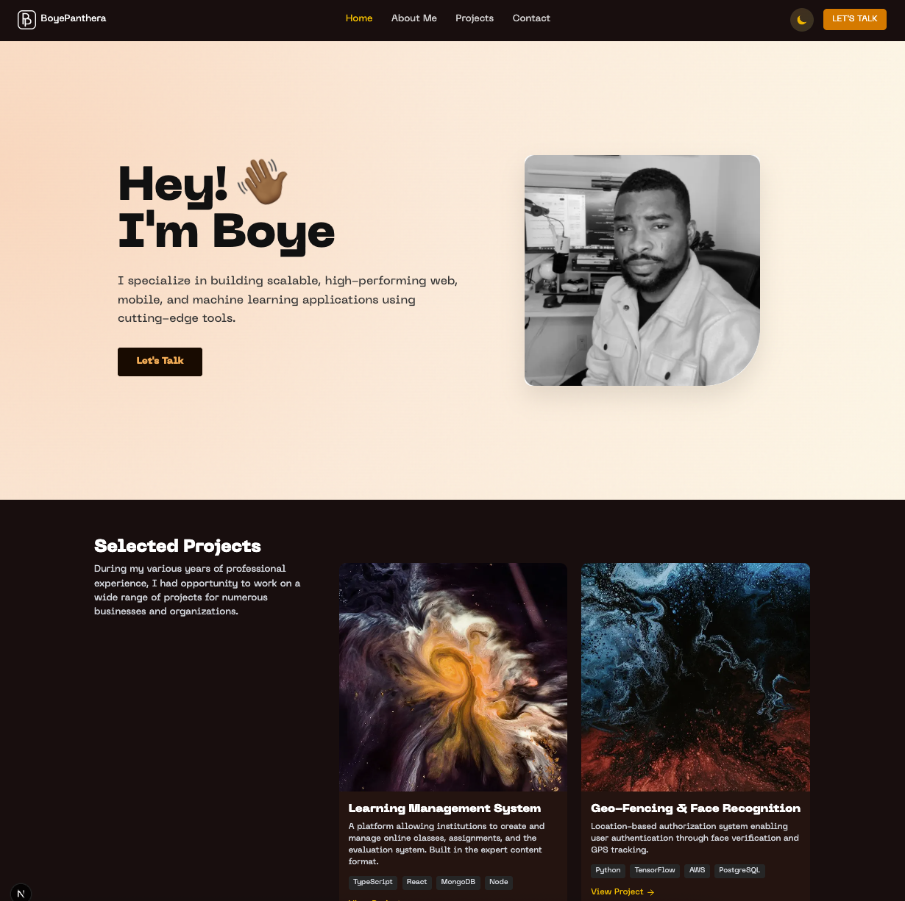

# BoyePanthera Portfolio Website

A modern, responsive software engineering portfolio website built with Next.js, featuring theme switching, custom animations, and showcasing projects and professional experience.



## 🚀 Features

- **Responsive Design**: Mobile-first approach ensuring perfect display across all devices
- **Theme Switching**: Elegant light/dark mode toggle with smooth transitions
- **Modern UI**: Clean, minimalist design with thoughtful animations and interactions
- **Portfolio Showcase**: Organized project gallery with filterable categories
- **Custom Typography**: Utilizing the premium PPNeueMachina font family
- **Performance Optimized**: Fast loading with optimized assets and code splitting

## 🛠️ Tech Stack

- **Framework**: [Next.js 14](https://nextjs.org/) with App Router
- **Styling**: [Tailwind CSS](https://tailwindcss.com/) for utility-first styling
- **Animations**: CSS transitions and keyframe animations
- **Deployment**: Vercel (production) / Netlify (preview)
- **Typography**: PPNeueMachina font family (Inktrap and Plain variants)
- **Icons**: Lucide React for consistent iconography

## 📋 Project Structure

```
boyepanthera-web/
├── app/
│   ├── components/         # Reusable UI components
│   ├── fonts.js            # Font configuration
│   ├── globals.css         # Global styles and CSS variables
│   ├── layout.js           # Root layout with theme provider
│   └── page.js             # Home page component
├── components/             # Shared components
│   ├── AboutMe.jsx         # About section
│   ├── ContactSection.jsx  # Contact form and info
│   ├── ExactMatchProjects.jsx # Projects gallery
│   ├── HeroSection.jsx     # Landing hero section
│   ├── Navbar.jsx          # Navigation with theme toggle
│   ├── Testimonials.jsx    # Client testimonials
│   ├── ThemeProvider.jsx   # Context for theme state
│   ├── ThemeToggle.jsx     # Theme switching button
│   ├── Toolbox.jsx         # Skills and technologies
│   └── WorkExperience.jsx  # Professional experience
├── public/                 # Static assets
│   ├── fonts/              # Custom font files
│   ├── projects/           # Project images
│   └── ...
├── .gitignore
├── next.config.js
├── package.json
├── README.md
└── tailwind.config.js
```

## 🏁 Getting Started

### Prerequisites

- Node.js 18.x or higher
- npm or yarn

### Installation

1. Clone the repository

   ```bash
   git clone https://github.com/yourusername/boyepanthera-web.git
   ```

2. Navigate to the project directory

   ```bash
   cd boyepanthera-web
   ```

3. Install dependencies

   ```bash
   npm install
   # or
   yarn install
   ```

4. Start the development server

   ```bash
   npm run dev
   # or
   yarn dev
   ```

5. Open [http://localhost:3000](http://localhost:3000) with your browser to see the result.

## 💻 Available Scripts

- `npm run dev` - Start the development server
- `npm run build` - Build the application for production
- `npm run start` - Start the production server
- `npm run lint` - Lint the codebase

## 🎨 Theme Customization

The portfolio uses a custom theming system that switches between light and dark modes:

- **Light Theme**: Warm beige/cream gradient with dark text
- **Dark Theme**: Rich brown/black gradient with light text and gold accents

Theme colors are defined in `globals.css` as CSS variables and in `tailwind.config.js` for Tailwind classes.

## 📝 Font Usage

The site uses the PPNeueMachina font family with two variants:

- **PPNeueMachina Inktrap** - Distinguished by notched corners (primary font)
- **PPNeueMachina Plain** - Clean geometric style (secondary font)

Each font comes in Light (300), Regular (400), and Ultrabold (800) weights with italic variants.

## 🧩 Component Usage

The main page is assembled from these key components:

```jsx
// app/page.js
export default function Home() {
  return (
    <main>
      <HeroSection />
      <ExactMatchProjects />
      <ExactMatchAboutMe />
      <Toolbox />
      <WorkExperience />
      <Testimonials />
      <SimpleContactSection />
    </main>
  );
}
```

## 🔄 State Management

Theme state is managed using React Context:

```jsx
// In any component
import { useTheme } from "@/components/ThemeProvider";

export default function MyComponent() {
  const { theme, toggleTheme } = useTheme();

  return (
    <div className={theme === "dark" ? "bg-dark-bg-primary" : "bg-white"}>
      {/* Component content */}
    </div>
  );
}
```

## 📱 Responsive Design

The site is fully responsive with carefully crafted breakpoints:

- **Mobile**: < 640px
- **Tablet**: 640px - 1024px
- **Desktop**: > 1024px

## 🌐 Deployment

The portfolio is hosted on Vercel and available at:

1. [https://boyepanthera.com](https://boyepanthera.com)
2. [http://localhost:3000](http://localhost:3000)

## 📄 License

This project is licensed under the MIT License - see the LICENSE file for details.

## 🤝 Acknowledgements

- Design inspiration from modern portfolio trends
- PPNeueMachina font by Pangram Pangram Foundry

---

Built with ❤️ by Boye | [GitHub](https://github.com/boyepanthera)
